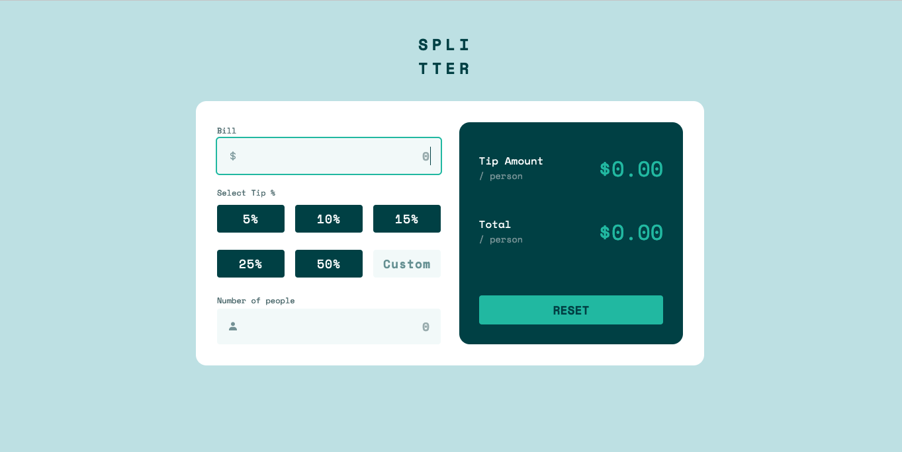

# Tip Calculator App

This app is a challenges from [Front mentor](https://www.frontendmentor.io/challenges/tip-calculator-app-ugJNGbJUX), they provide the user interface (colors and styles), but the code it's belong to me. I made it becasuse I want to improve my developerso skills, and I used these tecnologies:

- HTML5
- CSS3 (Flexbox and CSS Grid)
- Vanilla JS
- POO (Classes, Modules, Getter and Setters).